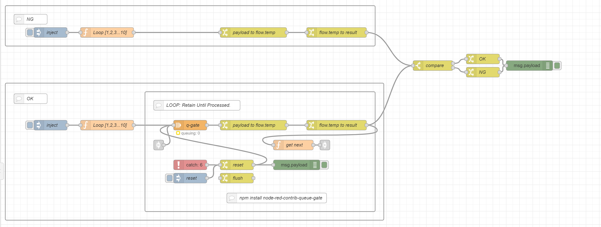

# node-red-flow-g-gate-retain-until-processed

g-gate: retain-until-processed

素晴らしいライブラリ`node-red-contrib-queue-gate`を使用しています。

```cmd
npm install node-red-contrib-queue-gate
```



[example]

```json
[
    {
        "id": "58e09ceb1fc736be",
        "type": "tab",
        "label": "フロー 1",
        "disabled": false,
        "info": ""
    },
    {
        "id": "40b39c3f47c45fb8",
        "type": "group",
        "z": "58e09ceb1fc736be",
        "style": {
            "stroke": "#999999",
            "stroke-opacity": "1",
            "fill": "none",
            "fill-opacity": "1",
            "label": true,
            "label-position": "nw",
            "color": "#a4a4a4"
        },
        "nodes": [
            "0d3fcb040b7003b5",
            "a1929bb7aa3fd76c",
            "d81494096eb606a8",
            "7505bfb4330aeae1",
            "3f8458a000e05a58"
        ],
        "x": 14,
        "y": 19,
        "w": 1112,
        "h": 122
    },
    {
        "id": "baf364ae3712dbc6",
        "type": "group",
        "z": "58e09ceb1fc736be",
        "style": {
            "stroke": "#999999",
            "stroke-opacity": "1",
            "fill": "none",
            "fill-opacity": "1",
            "label": true,
            "label-position": "nw",
            "color": "#a4a4a4"
        },
        "nodes": [
            "4d044b3a123f8109",
            "2bf7de94728da1e0",
            "04b2a9d57966cc8c",
            "b2ebcaf2deb4ac21"
        ],
        "x": 14,
        "y": 253,
        "w": 1138,
        "h": 414
    },
    {
        "id": "b2ebcaf2deb4ac21",
        "type": "group",
        "z": "58e09ceb1fc736be",
        "g": "baf364ae3712dbc6",
        "style": {
            "stroke": "#999999",
            "stroke-opacity": "1",
            "fill": "none",
            "fill-opacity": "1",
            "label": true,
            "label-position": "nw",
            "color": "#a4a4a4"
        },
        "nodes": [
            "3067f44277c8c591",
            "fb9d78adecdc4f3c",
            "c7635d5393ae8aaf",
            "0e405d43f0c63644",
            "3f85bf85134de4fc",
            "0dfbe68ff2a6c364",
            "49f26411a1a7f96c",
            "59c11a7a53b5c88e",
            "dc8a6de3e5bbff7b",
            "1756732dba182888",
            "0782540ba666c61c",
            "12bd304e2366b429",
            "9d1ccd72d5fd6339"
        ],
        "x": 434,
        "y": 279,
        "w": 692,
        "h": 362
    },
    {
        "id": "3067f44277c8c591",
        "type": "q-gate",
        "z": "58e09ceb1fc736be",
        "g": "b2ebcaf2deb4ac21",
        "name": "q-gate",
        "controlTopic": "control",
        "defaultState": "queueing",
        "openCmd": "open",
        "closeCmd": "close",
        "toggleCmd": "toggle",
        "queueCmd": "queue",
        "defaultCmd": "default",
        "triggerCmd": "trigger",
        "flushCmd": "flush",
        "resetCmd": "reset",
        "peekCmd": "peek",
        "dropCmd": "drop",
        "statusCmd": "status",
        "maxQueueLength": "100",
        "keepNewest": false,
        "qToggle": false,
        "persist": false,
        "x": 570,
        "y": 380,
        "wires": [
            [
                "12bd304e2366b429"
            ]
        ]
    },
    {
        "id": "fb9d78adecdc4f3c",
        "type": "link in",
        "z": "58e09ceb1fc736be",
        "g": "b2ebcaf2deb4ac21",
        "name": "",
        "links": [
            "c7635d5393ae8aaf"
        ],
        "x": 475,
        "y": 440,
        "wires": [
            [
                "3067f44277c8c591"
            ]
        ]
    },
    {
        "id": "c7635d5393ae8aaf",
        "type": "link out",
        "z": "58e09ceb1fc736be",
        "g": "b2ebcaf2deb4ac21",
        "name": "",
        "links": [
            "fb9d78adecdc4f3c"
        ],
        "x": 975,
        "y": 440,
        "wires": []
    },
    {
        "id": "0e405d43f0c63644",
        "type": "function",
        "z": "58e09ceb1fc736be",
        "g": "b2ebcaf2deb4ac21",
        "name": "get next",
        "func": "node.send({topic: \"control\", payload: \"drop\"})\nmsg.topic = \"control\"\nmsg.payload = \"peek\"\nreturn msg;",
        "outputs": 1,
        "noerr": 0,
        "initialize": "",
        "finalize": "",
        "libs": [],
        "x": 880,
        "y": 440,
        "wires": [
            [
                "c7635d5393ae8aaf"
            ]
        ]
    },
    {
        "id": "3f85bf85134de4fc",
        "type": "catch",
        "z": "58e09ceb1fc736be",
        "g": "b2ebcaf2deb4ac21",
        "name": "",
        "scope": [
            "ed843c3e1e78d963",
            "87faace2f40c362d",
            "3067f44277c8c591",
            "fb9d78adecdc4f3c",
            "c7635d5393ae8aaf",
            "0e405d43f0c63644"
        ],
        "uncaught": false,
        "x": 570,
        "y": 500,
        "wires": [
            [
                "0dfbe68ff2a6c364"
            ]
        ]
    },
    {
        "id": "0dfbe68ff2a6c364",
        "type": "change",
        "z": "58e09ceb1fc736be",
        "g": "b2ebcaf2deb4ac21",
        "name": "reset",
        "rules": [
            {
                "t": "set",
                "p": "payload",
                "pt": "msg",
                "to": "reset",
                "tot": "str"
            },
            {
                "t": "set",
                "p": "topic",
                "pt": "msg",
                "to": "control",
                "tot": "str"
            }
        ],
        "action": "",
        "property": "",
        "from": "",
        "to": "",
        "reg": false,
        "x": 710,
        "y": 500,
        "wires": [
            [
                "3067f44277c8c591",
                "49f26411a1a7f96c"
            ]
        ]
    },
    {
        "id": "49f26411a1a7f96c",
        "type": "debug",
        "z": "58e09ceb1fc736be",
        "g": "b2ebcaf2deb4ac21",
        "name": "",
        "active": true,
        "tosidebar": true,
        "console": false,
        "tostatus": false,
        "complete": "false",
        "statusVal": "",
        "statusType": "auto",
        "x": 890,
        "y": 500,
        "wires": []
    },
    {
        "id": "59c11a7a53b5c88e",
        "type": "change",
        "z": "58e09ceb1fc736be",
        "g": "b2ebcaf2deb4ac21",
        "name": " flush",
        "rules": [
            {
                "t": "set",
                "p": "payload",
                "pt": "msg",
                "to": "flush",
                "tot": "str"
            },
            {
                "t": "set",
                "p": "topic",
                "pt": "msg",
                "to": "control",
                "tot": "str"
            }
        ],
        "action": "",
        "property": "",
        "from": "",
        "to": "",
        "reg": false,
        "x": 710,
        "y": 540,
        "wires": [
            []
        ]
    },
    {
        "id": "dc8a6de3e5bbff7b",
        "type": "inject",
        "z": "58e09ceb1fc736be",
        "g": "b2ebcaf2deb4ac21",
        "name": "reset",
        "props": [],
        "repeat": "",
        "crontab": "",
        "once": false,
        "onceDelay": 0.1,
        "topic": "",
        "x": 570,
        "y": 540,
        "wires": [
            [
                "0dfbe68ff2a6c364"
            ]
        ]
    },
    {
        "id": "1756732dba182888",
        "type": "comment",
        "z": "58e09ceb1fc736be",
        "g": "b2ebcaf2deb4ac21",
        "name": "LOOP: Retain Until Processed.",
        "info": "Control Topic: \"Control\"",
        "x": 590,
        "y": 320,
        "wires": []
    },
    {
        "id": "0d3fcb040b7003b5",
        "type": "inject",
        "z": "58e09ceb1fc736be",
        "g": "40b39c3f47c45fb8",
        "name": "inject",
        "props": [
            {
                "p": "payload"
            },
            {
                "p": "topic",
                "vt": "str"
            }
        ],
        "repeat": "",
        "crontab": "",
        "once": false,
        "onceDelay": 0.1,
        "topic": "",
        "payloadType": "date",
        "x": 150,
        "y": 100,
        "wires": [
            [
                "a1929bb7aa3fd76c"
            ]
        ]
    },
    {
        "id": "a1929bb7aa3fd76c",
        "type": "function",
        "z": "58e09ceb1fc736be",
        "g": "40b39c3f47c45fb8",
        "name": "Loop [1,2,3...10]",
        "func": "// test: array data\nlet data = [];\nfor (let index = 0; index < 10; index++) {\n    data.push(index);\n}\n\n// node.send: array\ndata.forEach(function (element) {\n    msg.payload = element;\n    node.send(msg);\n});\n\n//return msg;",
        "outputs": 1,
        "noerr": 0,
        "initialize": "",
        "finalize": "",
        "libs": [],
        "x": 320,
        "y": 100,
        "wires": [
            [
                "d81494096eb606a8"
            ]
        ]
    },
    {
        "id": "d81494096eb606a8",
        "type": "change",
        "z": "58e09ceb1fc736be",
        "g": "40b39c3f47c45fb8",
        "name": "payload to flow.temp",
        "rules": [
            {
                "t": "set",
                "p": "temp",
                "pt": "flow",
                "to": "payload",
                "tot": "msg"
            }
        ],
        "action": "",
        "property": "",
        "from": "",
        "to": "",
        "reg": false,
        "x": 760,
        "y": 100,
        "wires": [
            [
                "7505bfb4330aeae1"
            ]
        ]
    },
    {
        "id": "7505bfb4330aeae1",
        "type": "change",
        "z": "58e09ceb1fc736be",
        "g": "40b39c3f47c45fb8",
        "name": "flow.temp to result",
        "rules": [
            {
                "t": "set",
                "p": "result",
                "pt": "msg",
                "to": "temp",
                "tot": "flow"
            }
        ],
        "action": "",
        "property": "",
        "from": "",
        "to": "",
        "reg": false,
        "x": 1010,
        "y": 100,
        "wires": [
            [
                "91a3cf13f562b042"
            ]
        ]
    },
    {
        "id": "4d044b3a123f8109",
        "type": "inject",
        "z": "58e09ceb1fc736be",
        "g": "baf364ae3712dbc6",
        "name": "inject",
        "props": [
            {
                "p": "payload"
            },
            {
                "p": "topic",
                "vt": "str"
            }
        ],
        "repeat": "",
        "crontab": "",
        "once": false,
        "onceDelay": 0.1,
        "topic": "",
        "payloadType": "date",
        "x": 150,
        "y": 380,
        "wires": [
            [
                "2bf7de94728da1e0"
            ]
        ]
    },
    {
        "id": "2bf7de94728da1e0",
        "type": "function",
        "z": "58e09ceb1fc736be",
        "g": "baf364ae3712dbc6",
        "name": "Loop [1,2,3...10]",
        "func": "// test: array data\nlet data = [];\nfor (let index = 0; index < 10; index++) {\n    data.push(index);\n}\n\n// node.send: array\ndata.forEach(function(element) {\n    msg.payload = element;\n    node.send(msg);\n});\n\n// control: peek\nmsg.payload = \"peek\";\nmsg.topic = \"control\";\n\nreturn msg;",
        "outputs": 1,
        "noerr": 0,
        "initialize": "",
        "finalize": "",
        "libs": [],
        "x": 320,
        "y": 380,
        "wires": [
            [
                "3067f44277c8c591"
            ]
        ]
    },
    {
        "id": "91a3cf13f562b042",
        "type": "switch",
        "z": "58e09ceb1fc736be",
        "name": "compare",
        "property": "payload",
        "propertyType": "msg",
        "rules": [
            {
                "t": "eq",
                "v": "result",
                "vt": "msg"
            },
            {
                "t": "else"
            }
        ],
        "checkall": "true",
        "repair": false,
        "outputs": 2,
        "x": 1300,
        "y": 200,
        "wires": [
            [
                "74f99ba92f766447"
            ],
            [
                "255b2a796a5ad2b7"
            ]
        ]
    },
    {
        "id": "74f99ba92f766447",
        "type": "change",
        "z": "58e09ceb1fc736be",
        "name": "OK",
        "rules": [
            {
                "t": "set",
                "p": "payload",
                "pt": "msg",
                "to": "OK",
                "tot": "str"
            }
        ],
        "action": "",
        "property": "",
        "from": "",
        "to": "",
        "reg": false,
        "x": 1450,
        "y": 180,
        "wires": [
            [
                "57e37ab59732ac1d"
            ]
        ]
    },
    {
        "id": "255b2a796a5ad2b7",
        "type": "change",
        "z": "58e09ceb1fc736be",
        "name": "NG",
        "rules": [
            {
                "t": "set",
                "p": "payload",
                "pt": "msg",
                "to": "NG",
                "tot": "str"
            }
        ],
        "action": "",
        "property": "",
        "from": "",
        "to": "",
        "reg": false,
        "x": 1450,
        "y": 220,
        "wires": [
            [
                "57e37ab59732ac1d"
            ]
        ]
    },
    {
        "id": "57e37ab59732ac1d",
        "type": "debug",
        "z": "58e09ceb1fc736be",
        "name": "",
        "active": true,
        "tosidebar": true,
        "console": false,
        "tostatus": false,
        "complete": "payload",
        "targetType": "msg",
        "statusVal": "",
        "statusType": "auto",
        "x": 1590,
        "y": 200,
        "wires": []
    },
    {
        "id": "3f8458a000e05a58",
        "type": "comment",
        "z": "58e09ceb1fc736be",
        "g": "40b39c3f47c45fb8",
        "name": "NG",
        "info": "",
        "x": 90,
        "y": 60,
        "wires": []
    },
    {
        "id": "04b2a9d57966cc8c",
        "type": "comment",
        "z": "58e09ceb1fc736be",
        "g": "baf364ae3712dbc6",
        "name": "OK",
        "info": "",
        "x": 90,
        "y": 300,
        "wires": []
    },
    {
        "id": "0782540ba666c61c",
        "type": "comment",
        "z": "58e09ceb1fc736be",
        "g": "b2ebcaf2deb4ac21",
        "name": "npm install node-red-contrib-queue-gate",
        "info": "",
        "x": 830,
        "y": 600,
        "wires": []
    },
    {
        "id": "12bd304e2366b429",
        "type": "change",
        "z": "58e09ceb1fc736be",
        "g": "b2ebcaf2deb4ac21",
        "name": "payload to flow.temp",
        "rules": [
            {
                "t": "set",
                "p": "temp",
                "pt": "flow",
                "to": "payload",
                "tot": "msg"
            }
        ],
        "action": "",
        "property": "",
        "from": "",
        "to": "",
        "reg": false,
        "x": 760,
        "y": 380,
        "wires": [
            [
                "9d1ccd72d5fd6339"
            ]
        ]
    },
    {
        "id": "9d1ccd72d5fd6339",
        "type": "change",
        "z": "58e09ceb1fc736be",
        "g": "b2ebcaf2deb4ac21",
        "name": "flow.temp to result",
        "rules": [
            {
                "t": "set",
                "p": "result",
                "pt": "msg",
                "to": "temp",
                "tot": "flow"
            }
        ],
        "action": "",
        "property": "",
        "from": "",
        "to": "",
        "reg": false,
        "x": 1010,
        "y": 380,
        "wires": [
            [
                "0e405d43f0c63644",
                "91a3cf13f562b042"
            ]
        ]
    }
]
```
