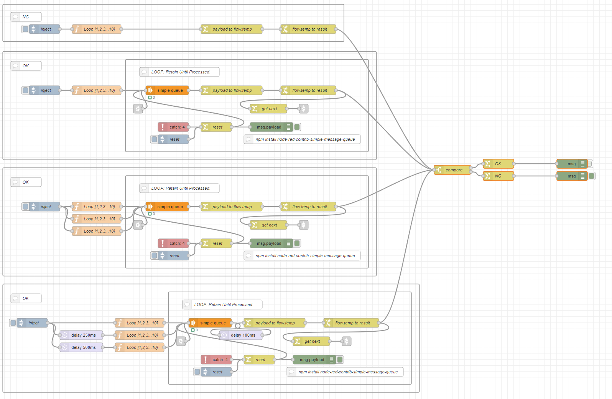

# node-red-flow-g-gate-retain-until-processed

g-gate: retain-until-processed

素晴らしいライブラリ`node-red-contrib-simple-message-queue`を使用しています。

```cmd
npm install node-red-contrib-simple-message-queue
```



[example]

```json
[
    {
        "id": "91a3cf13f562b042",
        "type": "switch",
        "z": "58e09ceb1fc736be",
        "name": "compare",
        "property": "payload",
        "propertyType": "msg",
        "rules": [
            {
                "t": "eq",
                "v": "result",
                "vt": "msg"
            },
            {
                "t": "else"
            }
        ],
        "checkall": "true",
        "repair": false,
        "outputs": 2,
        "x": 1480,
        "y": 560,
        "wires": [
            [
                "74f99ba92f766447"
            ],
            [
                "255b2a796a5ad2b7"
            ]
        ]
    },
    {
        "id": "74f99ba92f766447",
        "type": "change",
        "z": "58e09ceb1fc736be",
        "name": "OK",
        "rules": [
            {
                "t": "set",
                "p": "payload",
                "pt": "msg",
                "to": "OK",
                "tot": "str"
            }
        ],
        "action": "",
        "property": "",
        "from": "",
        "to": "",
        "reg": false,
        "x": 1630,
        "y": 540,
        "wires": [
            [
                "92bd1a88b223525f"
            ]
        ]
    },
    {
        "id": "255b2a796a5ad2b7",
        "type": "change",
        "z": "58e09ceb1fc736be",
        "name": "NG",
        "rules": [
            {
                "t": "set",
                "p": "payload",
                "pt": "msg",
                "to": "NG",
                "tot": "str"
            }
        ],
        "action": "",
        "property": "",
        "from": "",
        "to": "",
        "reg": false,
        "x": 1630,
        "y": 580,
        "wires": [
            [
                "57e37ab59732ac1d"
            ]
        ]
    },
    {
        "id": "57e37ab59732ac1d",
        "type": "debug",
        "z": "58e09ceb1fc736be",
        "name": "",
        "active": true,
        "tosidebar": true,
        "console": false,
        "tostatus": false,
        "complete": "true",
        "targetType": "full",
        "statusVal": "",
        "statusType": "auto",
        "x": 1870,
        "y": 580,
        "wires": []
    },
    {
        "id": "92bd1a88b223525f",
        "type": "debug",
        "z": "58e09ceb1fc736be",
        "name": "",
        "active": true,
        "tosidebar": true,
        "console": false,
        "tostatus": false,
        "complete": "true",
        "targetType": "full",
        "statusVal": "",
        "statusType": "auto",
        "x": 1870,
        "y": 540,
        "wires": []
    },
    {
        "id": "104e1d10dcb39c23",
        "type": "group",
        "z": "58e09ceb1fc736be",
        "style": {
            "stroke": "#999999",
            "stroke-opacity": "1",
            "fill": "none",
            "fill-opacity": "1",
            "label": true,
            "label-position": "nw",
            "color": "#a4a4a4"
        },
        "nodes": [
            "c51b0e6a0d0aa218",
            "c5bb752e4f88f1ec",
            "062b96786460f5d2",
            "26d06aea9aeab3e3",
            "60628535155d2edd",
            "48df0694db6c12a2"
        ],
        "x": 14,
        "y": 553,
        "w": 1218,
        "h": 354
    },
    {
        "id": "c51b0e6a0d0aa218",
        "type": "inject",
        "z": "58e09ceb1fc736be",
        "g": "104e1d10dcb39c23",
        "name": "inject",
        "props": [
            {
                "p": "payload"
            },
            {
                "p": "topic",
                "vt": "str"
            }
        ],
        "repeat": "",
        "crontab": "",
        "once": false,
        "onceDelay": 0.1,
        "topic": "",
        "payloadType": "date",
        "x": 150,
        "y": 680,
        "wires": [
            [
                "c5bb752e4f88f1ec",
                "60628535155d2edd",
                "48df0694db6c12a2"
            ]
        ]
    },
    {
        "id": "c5bb752e4f88f1ec",
        "type": "function",
        "z": "58e09ceb1fc736be",
        "g": "104e1d10dcb39c23",
        "name": "Loop [1,2,3...10]",
        "func": "// test: array data\nlet data = [];\nfor (let index = 0; index < 10; index++) {\n    data.push(index);\n}\n\n// node.send: array\ndata.forEach(function (element) {\n    msg.payload = element;\n    node.send(msg);\n});",
        "outputs": 1,
        "noerr": 0,
        "initialize": "",
        "finalize": "",
        "libs": [],
        "x": 320,
        "y": 680,
        "wires": [
            [
                "2aa6e205195363b4"
            ]
        ]
    },
    {
        "id": "062b96786460f5d2",
        "type": "comment",
        "z": "58e09ceb1fc736be",
        "g": "104e1d10dcb39c23",
        "name": "OK",
        "info": "",
        "x": 90,
        "y": 600,
        "wires": []
    },
    {
        "id": "26d06aea9aeab3e3",
        "type": "group",
        "z": "58e09ceb1fc736be",
        "g": "104e1d10dcb39c23",
        "style": {
            "stroke": "#999999",
            "stroke-opacity": "1",
            "fill": "none",
            "fill-opacity": "1",
            "label": true,
            "label-position": "nw",
            "color": "#a4a4a4"
        },
        "nodes": [
            "c23258fd773e3420",
            "8816623ef1c8e161",
            "8c7c0c16651ecc94",
            "504e93bd791c9550",
            "70d73b9e2b142555",
            "87886bbdc74c42a0",
            "ded55cceb3cd18f4",
            "83b5b1f680f44bb2",
            "7b34a83a161c6478",
            "3bd5d2bb18e6b84e",
            "2aa6e205195363b4",
            "71954da89e1e6e65"
        ],
        "x": 414,
        "y": 579,
        "w": 792,
        "h": 302
    },
    {
        "id": "c23258fd773e3420",
        "type": "catch",
        "z": "58e09ceb1fc736be",
        "g": "26d06aea9aeab3e3",
        "name": "",
        "scope": [
            "70d73b9e2b142555",
            "87886bbdc74c42a0",
            "2aa6e205195363b4",
            "71954da89e1e6e65"
        ],
        "uncaught": false,
        "x": 570,
        "y": 800,
        "wires": [
            [
                "83b5b1f680f44bb2"
            ]
        ]
    },
    {
        "id": "8816623ef1c8e161",
        "type": "debug",
        "z": "58e09ceb1fc736be",
        "g": "26d06aea9aeab3e3",
        "name": "",
        "active": true,
        "tosidebar": true,
        "console": false,
        "tostatus": false,
        "complete": "false",
        "statusVal": "",
        "statusType": "auto",
        "x": 890,
        "y": 800,
        "wires": []
    },
    {
        "id": "8c7c0c16651ecc94",
        "type": "comment",
        "z": "58e09ceb1fc736be",
        "g": "26d06aea9aeab3e3",
        "name": "LOOP: Retain Until Processed.",
        "info": "Control Topic: \"Control\"",
        "x": 590,
        "y": 620,
        "wires": []
    },
    {
        "id": "504e93bd791c9550",
        "type": "comment",
        "z": "58e09ceb1fc736be",
        "g": "26d06aea9aeab3e3",
        "name": "npm install node-red-contrib-simple-message-queue",
        "info": "",
        "x": 990,
        "y": 840,
        "wires": []
    },
    {
        "id": "70d73b9e2b142555",
        "type": "change",
        "z": "58e09ceb1fc736be",
        "g": "26d06aea9aeab3e3",
        "name": "payload to flow.temp",
        "rules": [
            {
                "t": "set",
                "p": "temp",
                "pt": "flow",
                "to": "payload",
                "tot": "msg"
            }
        ],
        "action": "",
        "property": "",
        "from": "",
        "to": "",
        "reg": false,
        "x": 760,
        "y": 680,
        "wires": [
            [
                "87886bbdc74c42a0"
            ]
        ]
    },
    {
        "id": "87886bbdc74c42a0",
        "type": "change",
        "z": "58e09ceb1fc736be",
        "g": "26d06aea9aeab3e3",
        "name": "flow.temp to result",
        "rules": [
            {
                "t": "set",
                "p": "result",
                "pt": "msg",
                "to": "temp",
                "tot": "flow"
            }
        ],
        "action": "",
        "property": "",
        "from": "",
        "to": "",
        "reg": false,
        "x": 1010,
        "y": 680,
        "wires": [
            [
                "71954da89e1e6e65",
                "91a3cf13f562b042"
            ]
        ]
    },
    {
        "id": "ded55cceb3cd18f4",
        "type": "inject",
        "z": "58e09ceb1fc736be",
        "g": "26d06aea9aeab3e3",
        "name": "reset",
        "props": [],
        "repeat": "",
        "crontab": "",
        "once": false,
        "onceDelay": 0.1,
        "topic": "",
        "payloadType": "str",
        "x": 570,
        "y": 840,
        "wires": [
            [
                "83b5b1f680f44bb2"
            ]
        ]
    },
    {
        "id": "83b5b1f680f44bb2",
        "type": "change",
        "z": "58e09ceb1fc736be",
        "g": "26d06aea9aeab3e3",
        "name": "reset",
        "rules": [
            {
                "t": "set",
                "p": "reset",
                "pt": "msg",
                "to": "1",
                "tot": "num"
            }
        ],
        "action": "",
        "property": "",
        "from": "",
        "to": "",
        "reg": false,
        "x": 710,
        "y": 800,
        "wires": [
            [
                "8816623ef1c8e161",
                "2aa6e205195363b4"
            ]
        ]
    },
    {
        "id": "7b34a83a161c6478",
        "type": "link in",
        "z": "58e09ceb1fc736be",
        "g": "26d06aea9aeab3e3",
        "name": "",
        "links": [
            "3bd5d2bb18e6b84e"
        ],
        "x": 455,
        "y": 740,
        "wires": [
            [
                "2aa6e205195363b4"
            ]
        ]
    },
    {
        "id": "3bd5d2bb18e6b84e",
        "type": "link out",
        "z": "58e09ceb1fc736be",
        "g": "26d06aea9aeab3e3",
        "name": "",
        "links": [
            "7b34a83a161c6478"
        ],
        "x": 995,
        "y": 740,
        "wires": []
    },
    {
        "id": "2aa6e205195363b4",
        "type": "simple-queue",
        "z": "58e09ceb1fc736be",
        "g": "26d06aea9aeab3e3",
        "name": "",
        "firstMessageBypass": true,
        "bypassInterval": "0",
        "x": 550,
        "y": 680,
        "wires": [
            [
                "70d73b9e2b142555"
            ]
        ]
    },
    {
        "id": "71954da89e1e6e65",
        "type": "change",
        "z": "58e09ceb1fc736be",
        "g": "26d06aea9aeab3e3",
        "name": "get next",
        "rules": [
            {
                "t": "set",
                "p": "trigger",
                "pt": "msg",
                "to": "1",
                "tot": "str"
            }
        ],
        "action": "",
        "property": "",
        "from": "",
        "to": "",
        "reg": false,
        "x": 880,
        "y": 740,
        "wires": [
            [
                "3bd5d2bb18e6b84e"
            ]
        ]
    },
    {
        "id": "60628535155d2edd",
        "type": "function",
        "z": "58e09ceb1fc736be",
        "g": "104e1d10dcb39c23",
        "name": "Loop [1,2,3...10]",
        "func": "// test: array data\nlet data = [];\nfor (let index = 0; index < 10; index++) {\n    data.push({ \"payload\": index });\n}\n\nreturn [data];\n",
        "outputs": 1,
        "noerr": 0,
        "initialize": "",
        "finalize": "",
        "libs": [],
        "x": 320,
        "y": 720,
        "wires": [
            [
                "2aa6e205195363b4"
            ]
        ]
    },
    {
        "id": "48df0694db6c12a2",
        "type": "function",
        "z": "58e09ceb1fc736be",
        "g": "104e1d10dcb39c23",
        "name": "Loop [1,2,3...10]",
        "func": "// test: array data\nlet data = [];\nfor (let index = 0; index < 10; index++) {\n    data.push({ \"payload\": index });\n}\n\nreturn [data];\n",
        "outputs": 1,
        "noerr": 0,
        "initialize": "",
        "finalize": "",
        "libs": [],
        "x": 320,
        "y": 760,
        "wires": [
            [
                "2aa6e205195363b4"
            ]
        ]
    },
    {
        "id": "40b39c3f47c45fb8",
        "type": "group",
        "z": "58e09ceb1fc736be",
        "style": {
            "stroke": "#999999",
            "stroke-opacity": "1",
            "fill": "none",
            "fill-opacity": "1",
            "label": true,
            "label-position": "nw",
            "color": "#a4a4a4"
        },
        "nodes": [
            "0d3fcb040b7003b5",
            "a1929bb7aa3fd76c",
            "d81494096eb606a8",
            "7505bfb4330aeae1",
            "3f8458a000e05a58"
        ],
        "x": 14,
        "y": 19,
        "w": 1112,
        "h": 122
    },
    {
        "id": "0d3fcb040b7003b5",
        "type": "inject",
        "z": "58e09ceb1fc736be",
        "g": "40b39c3f47c45fb8",
        "name": "inject",
        "props": [
            {
                "p": "payload"
            },
            {
                "p": "topic",
                "vt": "str"
            }
        ],
        "repeat": "",
        "crontab": "",
        "once": false,
        "onceDelay": 0.1,
        "topic": "",
        "payloadType": "date",
        "x": 150,
        "y": 100,
        "wires": [
            [
                "a1929bb7aa3fd76c"
            ]
        ]
    },
    {
        "id": "a1929bb7aa3fd76c",
        "type": "function",
        "z": "58e09ceb1fc736be",
        "g": "40b39c3f47c45fb8",
        "name": "Loop [1,2,3...10]",
        "func": "// test: array data\nlet data = [];\nfor (let index = 0; index < 10; index++) {\n    data.push(index);\n}\n\n// node.send: array\ndata.forEach(function (element) {\n    msg.payload = element;\n    node.send(msg);\n});\n\n//return msg;",
        "outputs": 1,
        "noerr": 0,
        "initialize": "",
        "finalize": "",
        "libs": [],
        "x": 320,
        "y": 100,
        "wires": [
            [
                "d81494096eb606a8"
            ]
        ]
    },
    {
        "id": "d81494096eb606a8",
        "type": "change",
        "z": "58e09ceb1fc736be",
        "g": "40b39c3f47c45fb8",
        "name": "payload to flow.temp",
        "rules": [
            {
                "t": "set",
                "p": "temp",
                "pt": "flow",
                "to": "payload",
                "tot": "msg"
            }
        ],
        "action": "",
        "property": "",
        "from": "",
        "to": "",
        "reg": false,
        "x": 760,
        "y": 100,
        "wires": [
            [
                "7505bfb4330aeae1"
            ]
        ]
    },
    {
        "id": "7505bfb4330aeae1",
        "type": "change",
        "z": "58e09ceb1fc736be",
        "g": "40b39c3f47c45fb8",
        "name": "flow.temp to result",
        "rules": [
            {
                "t": "set",
                "p": "result",
                "pt": "msg",
                "to": "temp",
                "tot": "flow"
            }
        ],
        "action": "",
        "property": "",
        "from": "",
        "to": "",
        "reg": false,
        "x": 1010,
        "y": 100,
        "wires": [
            [
                "91a3cf13f562b042"
            ]
        ]
    },
    {
        "id": "3f8458a000e05a58",
        "type": "comment",
        "z": "58e09ceb1fc736be",
        "g": "40b39c3f47c45fb8",
        "name": "NG",
        "info": "",
        "x": 90,
        "y": 60,
        "wires": []
    },
    {
        "id": "ced89956f3244fae",
        "type": "group",
        "z": "58e09ceb1fc736be",
        "style": {
            "stroke": "#999999",
            "stroke-opacity": "1",
            "fill": "none",
            "fill-opacity": "1",
            "label": true,
            "label-position": "nw",
            "color": "#a4a4a4"
        },
        "nodes": [
            "775e2e8c76a358cf",
            "1e2d5b553f465869",
            "58d365c84f948ef7",
            "6b38b72e27f510e1"
        ],
        "x": 14,
        "y": 173,
        "w": 1218,
        "h": 354
    },
    {
        "id": "775e2e8c76a358cf",
        "type": "inject",
        "z": "58e09ceb1fc736be",
        "g": "ced89956f3244fae",
        "name": "inject",
        "props": [
            {
                "p": "payload"
            },
            {
                "p": "topic",
                "vt": "str"
            }
        ],
        "repeat": "",
        "crontab": "",
        "once": false,
        "onceDelay": 0.1,
        "topic": "",
        "payloadType": "date",
        "x": 150,
        "y": 300,
        "wires": [
            [
                "1e2d5b553f465869"
            ]
        ]
    },
    {
        "id": "1e2d5b553f465869",
        "type": "function",
        "z": "58e09ceb1fc736be",
        "g": "ced89956f3244fae",
        "name": "Loop [1,2,3...10]",
        "func": "// test: array data\nlet data = [];\nfor (let index = 0; index < 10; index++) {\n    data.push(index);\n}\n\n// node.send: array\ndata.forEach(function (element) {\n    msg.payload = element;\n    node.send(msg);\n});",
        "outputs": 1,
        "noerr": 0,
        "initialize": "",
        "finalize": "",
        "libs": [],
        "x": 320,
        "y": 300,
        "wires": [
            [
                "2d9c1c51fd1ef768"
            ]
        ]
    },
    {
        "id": "58d365c84f948ef7",
        "type": "comment",
        "z": "58e09ceb1fc736be",
        "g": "ced89956f3244fae",
        "name": "OK",
        "info": "",
        "x": 90,
        "y": 220,
        "wires": []
    },
    {
        "id": "6b38b72e27f510e1",
        "type": "group",
        "z": "58e09ceb1fc736be",
        "g": "ced89956f3244fae",
        "style": {
            "stroke": "#999999",
            "stroke-opacity": "1",
            "fill": "none",
            "fill-opacity": "1",
            "label": true,
            "label-position": "nw",
            "color": "#a4a4a4"
        },
        "nodes": [
            "61a5dc9b39784735",
            "6dcc3c50535fcab4",
            "2057947a748f1d07",
            "032099815e9d0004",
            "367ae6dce4e34f0c",
            "f3b61244868ce34d",
            "3956ce93876c1757",
            "fcba1dd53785d73e",
            "05f7d76851bca153",
            "5736beae7ec39fbf",
            "2d9c1c51fd1ef768",
            "4b4ddab2fd25c2fb"
        ],
        "x": 414,
        "y": 199,
        "w": 792,
        "h": 302
    },
    {
        "id": "61a5dc9b39784735",
        "type": "catch",
        "z": "58e09ceb1fc736be",
        "g": "6b38b72e27f510e1",
        "name": "",
        "scope": [
            "2d9c1c51fd1ef768",
            "367ae6dce4e34f0c",
            "f3b61244868ce34d",
            "4b4ddab2fd25c2fb"
        ],
        "uncaught": false,
        "x": 570,
        "y": 420,
        "wires": [
            [
                "fcba1dd53785d73e"
            ]
        ]
    },
    {
        "id": "6dcc3c50535fcab4",
        "type": "debug",
        "z": "58e09ceb1fc736be",
        "g": "6b38b72e27f510e1",
        "name": "",
        "active": true,
        "tosidebar": true,
        "console": false,
        "tostatus": false,
        "complete": "false",
        "statusVal": "",
        "statusType": "auto",
        "x": 890,
        "y": 420,
        "wires": []
    },
    {
        "id": "2057947a748f1d07",
        "type": "comment",
        "z": "58e09ceb1fc736be",
        "g": "6b38b72e27f510e1",
        "name": "LOOP: Retain Until Processed.",
        "info": "Control Topic: \"Control\"",
        "x": 590,
        "y": 240,
        "wires": []
    },
    {
        "id": "032099815e9d0004",
        "type": "comment",
        "z": "58e09ceb1fc736be",
        "g": "6b38b72e27f510e1",
        "name": "npm install node-red-contrib-simple-message-queue",
        "info": "",
        "x": 990,
        "y": 460,
        "wires": []
    },
    {
        "id": "367ae6dce4e34f0c",
        "type": "change",
        "z": "58e09ceb1fc736be",
        "g": "6b38b72e27f510e1",
        "name": "payload to flow.temp",
        "rules": [
            {
                "t": "set",
                "p": "temp",
                "pt": "flow",
                "to": "payload",
                "tot": "msg"
            }
        ],
        "action": "",
        "property": "",
        "from": "",
        "to": "",
        "reg": false,
        "x": 760,
        "y": 300,
        "wires": [
            [
                "f3b61244868ce34d"
            ]
        ]
    },
    {
        "id": "f3b61244868ce34d",
        "type": "change",
        "z": "58e09ceb1fc736be",
        "g": "6b38b72e27f510e1",
        "name": "flow.temp to result",
        "rules": [
            {
                "t": "set",
                "p": "result",
                "pt": "msg",
                "to": "temp",
                "tot": "flow"
            }
        ],
        "action": "",
        "property": "",
        "from": "",
        "to": "",
        "reg": false,
        "x": 1010,
        "y": 300,
        "wires": [
            [
                "91a3cf13f562b042",
                "4b4ddab2fd25c2fb"
            ]
        ]
    },
    {
        "id": "3956ce93876c1757",
        "type": "inject",
        "z": "58e09ceb1fc736be",
        "g": "6b38b72e27f510e1",
        "name": "reset",
        "props": [],
        "repeat": "",
        "crontab": "",
        "once": false,
        "onceDelay": 0.1,
        "topic": "",
        "payloadType": "str",
        "x": 570,
        "y": 460,
        "wires": [
            [
                "fcba1dd53785d73e"
            ]
        ]
    },
    {
        "id": "fcba1dd53785d73e",
        "type": "change",
        "z": "58e09ceb1fc736be",
        "g": "6b38b72e27f510e1",
        "name": "reset",
        "rules": [
            {
                "t": "set",
                "p": "reset",
                "pt": "msg",
                "to": "1",
                "tot": "num"
            }
        ],
        "action": "",
        "property": "",
        "from": "",
        "to": "",
        "reg": false,
        "x": 710,
        "y": 420,
        "wires": [
            [
                "6dcc3c50535fcab4",
                "2d9c1c51fd1ef768"
            ]
        ]
    },
    {
        "id": "05f7d76851bca153",
        "type": "link in",
        "z": "58e09ceb1fc736be",
        "g": "6b38b72e27f510e1",
        "name": "",
        "links": [
            "5736beae7ec39fbf"
        ],
        "x": 455,
        "y": 360,
        "wires": [
            [
                "2d9c1c51fd1ef768"
            ]
        ]
    },
    {
        "id": "5736beae7ec39fbf",
        "type": "link out",
        "z": "58e09ceb1fc736be",
        "g": "6b38b72e27f510e1",
        "name": "",
        "links": [
            "05f7d76851bca153"
        ],
        "x": 995,
        "y": 360,
        "wires": []
    },
    {
        "id": "2d9c1c51fd1ef768",
        "type": "simple-queue",
        "z": "58e09ceb1fc736be",
        "g": "6b38b72e27f510e1",
        "name": "",
        "firstMessageBypass": true,
        "bypassInterval": "0",
        "x": 550,
        "y": 300,
        "wires": [
            [
                "367ae6dce4e34f0c"
            ]
        ]
    },
    {
        "id": "4b4ddab2fd25c2fb",
        "type": "change",
        "z": "58e09ceb1fc736be",
        "g": "6b38b72e27f510e1",
        "name": "get next",
        "rules": [
            {
                "t": "set",
                "p": "trigger",
                "pt": "msg",
                "to": "1",
                "tot": "str"
            }
        ],
        "action": "",
        "property": "",
        "from": "",
        "to": "",
        "reg": false,
        "x": 880,
        "y": 360,
        "wires": [
            [
                "5736beae7ec39fbf"
            ]
        ]
    },
    {
        "id": "f3435aeb45c4eb5f",
        "type": "group",
        "z": "58e09ceb1fc736be",
        "style": {
            "stroke": "#999999",
            "stroke-opacity": "1",
            "fill": "none",
            "fill-opacity": "1",
            "label": true,
            "label-position": "nw",
            "color": "#a4a4a4"
        },
        "nodes": [
            "c1e930bba2c683c6",
            "97805527ddaca079",
            "77adec63f93364b1",
            "7fbfb04655eb8795",
            "9ef3d7af99c2f866",
            "8ac6683aed6dda98",
            "9217d9abf435b896",
            "c7a76e3d3a85e261"
        ],
        "x": 14,
        "y": 933,
        "w": 1358,
        "h": 354
    },
    {
        "id": "c1e930bba2c683c6",
        "type": "function",
        "z": "58e09ceb1fc736be",
        "g": "f3435aeb45c4eb5f",
        "name": "Loop [1,2,3...10]",
        "func": "// test: array data\nlet data = [];\nfor (let index = 0; index < 10; index++) {\n    data.push(index);\n}\n\n// node.send: array\ndata.forEach(function (element) {\n    msg.payload = element;\n    node.send(msg);\n});",
        "outputs": 1,
        "noerr": 0,
        "initialize": "",
        "finalize": "",
        "libs": [],
        "x": 460,
        "y": 1060,
        "wires": [
            [
                "b56d1a39ba2bb8cc"
            ]
        ]
    },
    {
        "id": "97805527ddaca079",
        "type": "comment",
        "z": "58e09ceb1fc736be",
        "g": "f3435aeb45c4eb5f",
        "name": "OK",
        "info": "",
        "x": 90,
        "y": 980,
        "wires": []
    },
    {
        "id": "77adec63f93364b1",
        "type": "group",
        "z": "58e09ceb1fc736be",
        "g": "f3435aeb45c4eb5f",
        "style": {
            "stroke": "#999999",
            "stroke-opacity": "1",
            "fill": "none",
            "fill-opacity": "1",
            "label": true,
            "label-position": "nw",
            "color": "#a4a4a4"
        },
        "nodes": [
            "51614d2bdf452eaf",
            "b9419d87f6de4818",
            "e66a906fbf6eb2f9",
            "9f82740654047696",
            "40ad14cf7ff7dac2",
            "5c2011318ced4612",
            "8fb799dd71972c38",
            "b86dbe06cab279fb",
            "4cc991cf0a920433",
            "6fc0b574c788723b",
            "b56d1a39ba2bb8cc",
            "b296bc410348be9f",
            "77cbe7d23a2c6703"
        ],
        "x": 554,
        "y": 959,
        "w": 792,
        "h": 302
    },
    {
        "id": "51614d2bdf452eaf",
        "type": "catch",
        "z": "58e09ceb1fc736be",
        "g": "77adec63f93364b1",
        "name": "",
        "scope": [
            "40ad14cf7ff7dac2",
            "5c2011318ced4612",
            "b56d1a39ba2bb8cc",
            "b296bc410348be9f"
        ],
        "uncaught": false,
        "x": 710,
        "y": 1180,
        "wires": [
            [
                "b86dbe06cab279fb"
            ]
        ]
    },
    {
        "id": "b9419d87f6de4818",
        "type": "debug",
        "z": "58e09ceb1fc736be",
        "g": "77adec63f93364b1",
        "name": "",
        "active": true,
        "tosidebar": true,
        "console": false,
        "tostatus": false,
        "complete": "false",
        "statusVal": "",
        "statusType": "auto",
        "x": 1030,
        "y": 1180,
        "wires": []
    },
    {
        "id": "e66a906fbf6eb2f9",
        "type": "comment",
        "z": "58e09ceb1fc736be",
        "g": "77adec63f93364b1",
        "name": "LOOP: Retain Until Processed.",
        "info": "Control Topic: \"Control\"",
        "x": 730,
        "y": 1000,
        "wires": []
    },
    {
        "id": "9f82740654047696",
        "type": "comment",
        "z": "58e09ceb1fc736be",
        "g": "77adec63f93364b1",
        "name": "npm install node-red-contrib-simple-message-queue",
        "info": "",
        "x": 1130,
        "y": 1220,
        "wires": []
    },
    {
        "id": "40ad14cf7ff7dac2",
        "type": "change",
        "z": "58e09ceb1fc736be",
        "g": "77adec63f93364b1",
        "name": "payload to flow.temp",
        "rules": [
            {
                "t": "set",
                "p": "temp",
                "pt": "flow",
                "to": "payload",
                "tot": "msg"
            }
        ],
        "action": "",
        "property": "",
        "from": "",
        "to": "",
        "reg": false,
        "x": 900,
        "y": 1060,
        "wires": [
            [
                "5c2011318ced4612"
            ]
        ]
    },
    {
        "id": "5c2011318ced4612",
        "type": "change",
        "z": "58e09ceb1fc736be",
        "g": "77adec63f93364b1",
        "name": "flow.temp to result",
        "rules": [
            {
                "t": "set",
                "p": "result",
                "pt": "msg",
                "to": "temp",
                "tot": "flow"
            }
        ],
        "action": "",
        "property": "",
        "from": "",
        "to": "",
        "reg": false,
        "x": 1150,
        "y": 1060,
        "wires": [
            [
                "b296bc410348be9f",
                "91a3cf13f562b042"
            ]
        ]
    },
    {
        "id": "8fb799dd71972c38",
        "type": "inject",
        "z": "58e09ceb1fc736be",
        "g": "77adec63f93364b1",
        "name": "reset",
        "props": [],
        "repeat": "",
        "crontab": "",
        "once": false,
        "onceDelay": 0.1,
        "topic": "",
        "payloadType": "str",
        "x": 710,
        "y": 1220,
        "wires": [
            [
                "b86dbe06cab279fb"
            ]
        ]
    },
    {
        "id": "b86dbe06cab279fb",
        "type": "change",
        "z": "58e09ceb1fc736be",
        "g": "77adec63f93364b1",
        "name": "reset",
        "rules": [
            {
                "t": "set",
                "p": "reset",
                "pt": "msg",
                "to": "1",
                "tot": "num"
            }
        ],
        "action": "",
        "property": "",
        "from": "",
        "to": "",
        "reg": false,
        "x": 850,
        "y": 1180,
        "wires": [
            [
                "b9419d87f6de4818",
                "b56d1a39ba2bb8cc"
            ]
        ]
    },
    {
        "id": "4cc991cf0a920433",
        "type": "link in",
        "z": "58e09ceb1fc736be",
        "g": "77adec63f93364b1",
        "name": "",
        "links": [
            "6fc0b574c788723b"
        ],
        "x": 595,
        "y": 1120,
        "wires": [
            [
                "b56d1a39ba2bb8cc"
            ]
        ]
    },
    {
        "id": "6fc0b574c788723b",
        "type": "link out",
        "z": "58e09ceb1fc736be",
        "g": "77adec63f93364b1",
        "name": "",
        "links": [
            "4cc991cf0a920433"
        ],
        "x": 1135,
        "y": 1120,
        "wires": []
    },
    {
        "id": "b56d1a39ba2bb8cc",
        "type": "simple-queue",
        "z": "58e09ceb1fc736be",
        "g": "77adec63f93364b1",
        "name": "",
        "firstMessageBypass": true,
        "bypassInterval": "0",
        "x": 690,
        "y": 1060,
        "wires": [
            [
                "77cbe7d23a2c6703"
            ]
        ]
    },
    {
        "id": "b296bc410348be9f",
        "type": "change",
        "z": "58e09ceb1fc736be",
        "g": "77adec63f93364b1",
        "name": "get next",
        "rules": [
            {
                "t": "set",
                "p": "trigger",
                "pt": "msg",
                "to": "1",
                "tot": "str"
            }
        ],
        "action": "",
        "property": "",
        "from": "",
        "to": "",
        "reg": false,
        "x": 1020,
        "y": 1120,
        "wires": [
            [
                "6fc0b574c788723b"
            ]
        ]
    },
    {
        "id": "77cbe7d23a2c6703",
        "type": "delay",
        "z": "58e09ceb1fc736be",
        "g": "77adec63f93364b1",
        "name": "",
        "pauseType": "delay",
        "timeout": "100",
        "timeoutUnits": "milliseconds",
        "rate": "1",
        "nbRateUnits": "1",
        "rateUnits": "second",
        "randomFirst": "1",
        "randomLast": "5",
        "randomUnits": "seconds",
        "drop": false,
        "allowrate": false,
        "x": 790,
        "y": 1100,
        "wires": [
            [
                "40ad14cf7ff7dac2"
            ]
        ]
    },
    {
        "id": "7fbfb04655eb8795",
        "type": "function",
        "z": "58e09ceb1fc736be",
        "g": "f3435aeb45c4eb5f",
        "name": "Loop [1,2,3...10]",
        "func": "// test: array data\nlet data = [];\nfor (let index = 0; index < 10; index++) {\n    data.push({ \"payload\": index });\n}\n\nreturn [data];\n",
        "outputs": 1,
        "noerr": 0,
        "initialize": "",
        "finalize": "",
        "libs": [],
        "x": 460,
        "y": 1100,
        "wires": [
            [
                "b56d1a39ba2bb8cc"
            ]
        ]
    },
    {
        "id": "9ef3d7af99c2f866",
        "type": "function",
        "z": "58e09ceb1fc736be",
        "g": "f3435aeb45c4eb5f",
        "name": "Loop [1,2,3...10]",
        "func": "// test: array data\nlet data = [];\nfor (let index = 0; index < 10; index++) {\n    data.push({ \"payload\": index });\n}\n\nreturn [data];\n",
        "outputs": 1,
        "noerr": 0,
        "initialize": "",
        "finalize": "",
        "libs": [],
        "x": 460,
        "y": 1140,
        "wires": [
            [
                "b56d1a39ba2bb8cc"
            ]
        ]
    },
    {
        "id": "8ac6683aed6dda98",
        "type": "delay",
        "z": "58e09ceb1fc736be",
        "g": "f3435aeb45c4eb5f",
        "name": "",
        "pauseType": "delay",
        "timeout": "500",
        "timeoutUnits": "milliseconds",
        "rate": "1",
        "nbRateUnits": "1",
        "rateUnits": "second",
        "randomFirst": "1",
        "randomLast": "5",
        "randomUnits": "seconds",
        "drop": false,
        "allowrate": false,
        "x": 270,
        "y": 1140,
        "wires": [
            [
                "9ef3d7af99c2f866"
            ]
        ]
    },
    {
        "id": "9217d9abf435b896",
        "type": "delay",
        "z": "58e09ceb1fc736be",
        "g": "f3435aeb45c4eb5f",
        "name": "",
        "pauseType": "delay",
        "timeout": "250",
        "timeoutUnits": "milliseconds",
        "rate": "1",
        "nbRateUnits": "1",
        "rateUnits": "second",
        "randomFirst": "1",
        "randomLast": "5",
        "randomUnits": "seconds",
        "drop": false,
        "allowrate": false,
        "x": 270,
        "y": 1100,
        "wires": [
            [
                "7fbfb04655eb8795"
            ]
        ]
    },
    {
        "id": "c7a76e3d3a85e261",
        "type": "inject",
        "z": "58e09ceb1fc736be",
        "g": "f3435aeb45c4eb5f",
        "name": "inject",
        "props": [
            {
                "p": "payload"
            },
            {
                "p": "topic",
                "vt": "str"
            }
        ],
        "repeat": "",
        "crontab": "",
        "once": false,
        "onceDelay": 0.1,
        "topic": "",
        "payloadType": "date",
        "x": 110,
        "y": 1060,
        "wires": [
            [
                "c1e930bba2c683c6",
                "8ac6683aed6dda98",
                "9217d9abf435b896"
            ]
        ]
    }
]
```
